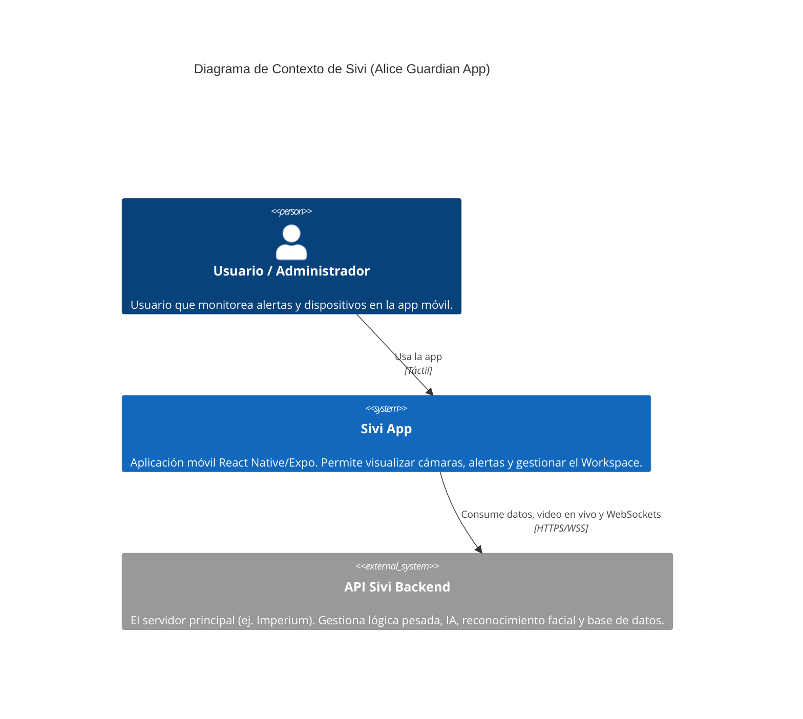
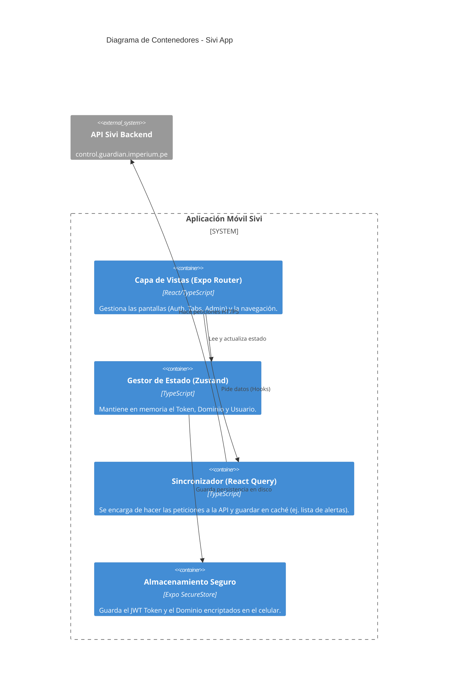

# Modelo de Arquitectura (C4)

Este documento explica cómo funciona la aplicación Sivi a vista de pájaro, para que sea fácil de entender.

## 1. Diagrama de Contexto (Nivel 1)
*¿Quién usa el sistema y con qué interactúa?*

---

## 2. Diagrama de Contenedores (Nivel 2)
*¿Cómo está estructurada la app móvil por dentro?*

**Explicación Simple:**
1. Las pantallas (**Expo Router**) piden datos usando **React Query**.
2. **React Query** se comunica con la **API externa**.
3. Si la pantalla necesita saber quién está logueado, le pregunta a **Zustand**.
4. **Zustand** guarda la sesión de forma segura usando **SecureStore** para que al reiniciar la app no haya que volver a poner la contraseña.
