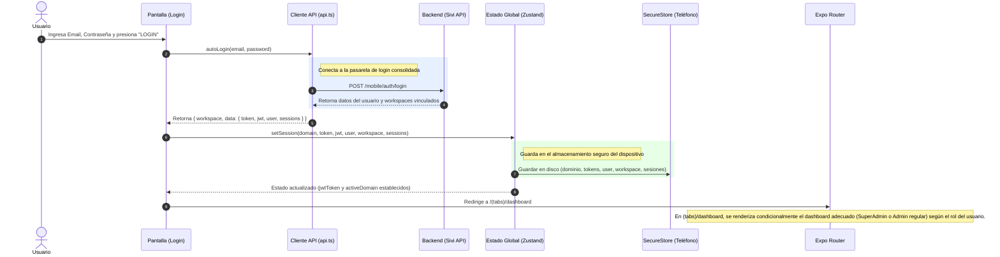
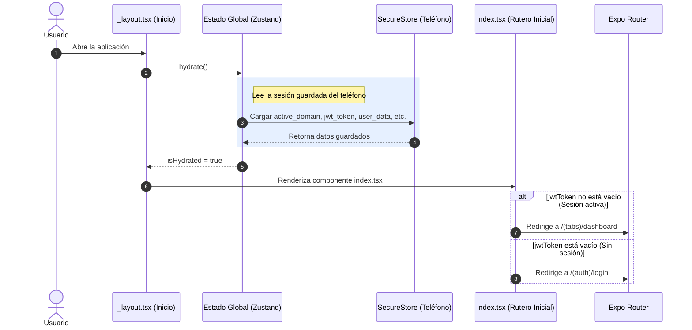

# Diagramas de Secuencia

Estos diagramas explican paso a paso cómo suceden los flujos más importantes en la aplicación. Son fáciles de leer de arriba hacia abajo.

## 1. Flujo de Inicio de Sesión (Login)

Este es el proceso exacto de lo que ocurre cuando un usuario presiona "Ingresar" en la pantalla de Login.

## 2. Flujo de Hidratación (Abrir la App)

¿Qué pasa cuando el usuario cierra y vuelve a abrir la app? No queremos que inicie sesión otra vez. A esto le llamamos "Hidratación".

