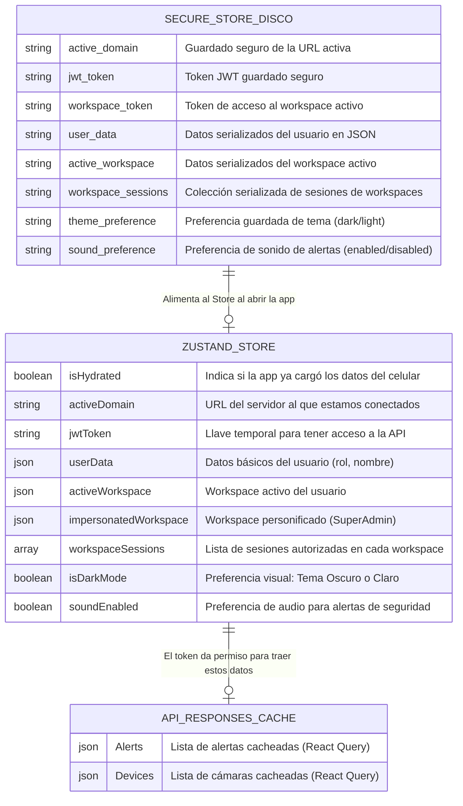

# Modelo de Datos (Estado Global de la App)

A diferencia de una aplicación web tradicional, esta aplicación móvil no tiene una base de datos local grande (como SQLite). En su lugar, utilizamos un **Store en memoria (Zustand)** para guardar los datos que se necesitan rápido, y **SecureStore** para guardarlos en el disco físico del celular para que no se borren.

Este diagrama muestra exactamente qué datos guarda la aplicación para funcionar. Es muy sencillo de entender.

### ¿Qué significa esto de forma práctica?

1. **Zustand Store:** Es la memoria rápida. Si la pantalla de Perfil quiere saber el nombre del usuario, se lo pide a `userData` en Zustand. Es instantáneo.
2. **Secure Store (Disco):** Si apagas el celular y vuelves a abrir la app, la memoria rápida (Zustand) está vacía. Entonces, la app lee el `Secure Store` (el disco) para recuperar el `jwtToken` y no pedirte que inicies sesión de nuevo. A este proceso se le llama **Hidratación**.
3. **Caché (React Query):** Los datos grandes (listas de cámaras, alertas de movimiento) **no** se guardan de por vida en el celular. Se traen de internet y se guardan temporalmente en caché para que la app se sienta rápida, pero se descartan cuando se cierra la aplicación.

