# 🔄 Flujos de Datos, Ciclos de Vida y Diagramas de Secuencia (Mermaid.js)
> **Documento 03:** Planos técnicos de secuencia y flujos de datos interactivos, diseñados para visualizarse en Mermaid.js y Markdown Live Preview.

---

## 🔐 1. Flujo de Inicio de Sesión y Selección de Workspaces
Este diagrama detalla la secuencia de autenticación centralizada a través de la REST API y la persistencia segura del token JWT en el dispositivo móvil:

```mermaid
sequenceDiagram
    autonumber
    actor Operador as Operador de Seguridad
    participant UI as Login (Pantalla de Acceso)
    participant API as Capa de Red (api.ts)
    participant Store as Estado Global (Zustand Store)
    participant Cloud as Servidor SIVI (BFF en la Nube)

    Operador->>UI: Ingresa Email e Imperium Password
    UI->>API: autoLogin("email", "password")
    
    rect rgb(20, 25, 40)
        Note over API: Itera sobre dominios registrados
        API->>Cloud: POST /api/v1/auth/login (Credenciales)
        Cloud-->>API: Retorna JSON { jwt: "TokenJWT", user: {...} }
    end

    API->>Store: clearSession() y guardarSession({ jwt, domain, user })
    Note over Store: Guarda Token en Expo Secure Store<br/>para mantener la sesión persistente
    Store-->>UI: Notifica cambio de estado de sesión
    UI->>Operador: Redirecciona automáticamente a la pestaña Dashboard
```



---

## 🎥 2. Negociación Híbrida de Video (WebRTC / HLS)
Este flujo detalla la negociación Peer-to-Peer a través del protocolo WHEP para transmisiones con latencia menor a un segundo, y su caída automática (fallback) a HLS:

```mermaid
sequenceDiagram
    autonumber
    participant UI as Interfaz Cámaras (Grid)
    participant WV as WebView Container (HMTL5 Player)
    participant Media as Servidor MediaMTX (control.sivi...)

    UI->>WV: Carga reproductor con stream_name e inyecta Token
    
    rect rgb(25, 20, 20)
        Note over WV: Paso 1: Intentar WebRTC (WHEP)
        WV->>Media: POST /stream_name/whep (SDP Offer + Bearer Token)
        Media-->>WV: Retorna SDP Answer (201 Created + Header Location)
        WV->>Media: PATCH /stream_name/whep (ICE Candidates Descubiertos)
        Note over WV: Conectando video P2P...
    end

    alt Conexión WebRTC Establecida Exitosamente
        Media-->>WV: Flujo de Video Directo H.264 (Latencia < 1s)
    else Falla de ICE o Bloqueo de Red UDP (Fallback en < 3s)
        Note over WV: Paso 2: Caída Automática a HLS
        WV->>Media: GET /stream_name/index.m3u8
        Media-->>WV: Retorna Manifiesto M3U8 y Segmentos TS
        WV->>UI: Renderiza transmisión de video HLS (Latencia 3-5s)
    end
```



---

## 📡 3. Recepción y Normalización de Eventos en Tiempo Real
El siguiente flujo describe cómo se capturan las detecciones inteligentes de la nube mediante WebSockets y se transforman antes de renderizarse en el teléfono:

```mermaid
graph TD
    %% Definición de Estilos
    classDef cloudStyle fill:#2A1B1B,stroke:#F44336,stroke-width:2px,color:#fff;
    classDef socketStyle fill:#162435,stroke:#2E9BFF,stroke-width:2px,color:#fff;
    classDef bffStyle fill:#162E25,stroke:#4CAF50,stroke-width:2px,color:#fff;
    classDef uiStyle fill:#1C1D2A,stroke:#ffffff20,stroke-width:1px,color:#fff;

    %% Nodos
    A[Cámara IP en Campo]:::cloudStyle -->|Video en Bruto| B(Edge Node: Motor de Analíticas de IA):::cloudStyle
    B -->|Detección de Intruder / Rostro| C(Servidor SIVI Imperium Cloud):::cloudStyle
    
    subgraph Socket Connection (WSS)
        C -->|Emit 'alert' / 'face' / 'lpr'| D(Socket.IO Server en control.guardian...):::socketStyle
        D -->|Websocket Stream EIO=3| E(AlertSocketService en AliceGuardian Mobile):::socketStyle
    end
    
    subgraph Frontend Normalization Layer
        E -->|Payload Crudo snake_case| F[api.ts: normalizeAlertsData / normalizeSearchRows]:::bffStyle
        F -->|Une con activeDomain para construir URLs de Fotos| G[Estandariza a CamelCase e íconos dinámicos]:::bffStyle
    end

    G -->|Actualiza Estado: setAlerts| H(Pestaña de Alertas: Renderizado Reactivo):::uiStyle
    G -->|Actualiza Estado: setRecentAlerts| I(Pestaña de Dashboard: Renderizado de Turno):::uiStyle
```

---

## 🚨 4. Resolución de Alertas y Sincronización de Turnos
Flujo interactivo de toma de acciones desde la aplicación móvil y su sincronización inmediata con las estadísticas de la pantalla:

```mermaid
sequenceDiagram
    autonumber
    actor Operador as Operador de Seguridad
    participant UI as Pantalla Alertas (Grid)
    participant Modal as Modal de Detalle (Estilo Web)
    participant State as Estado Local (Zustand / React State)
    participant Top as Widgets del Turno (Cabecera)

    Operador->>UI: Toca tarjeta de alerta en cuadrícula
    UI->>Modal: Abre Modal de Alta Fidelidad (Carga Cara y Evidencia)
    Operador->>Modal: Presiona botón "Confirmar Alerta" o "Falso Positivo"
    
    rect rgb(20, 25, 20)
        Note over Modal: Invoca handleQuickAction(alert, action)
        Modal->>State: Ejecuta setAlerts() (Actualiza is_confirmed)
        State->>Top: Recalcula confirmedCount / falseCount (+1 dinámico)
    end
    
    State-->>Modal: Cierra el modal con animación suave
    Top-->>Operador: Muestra contadores de seguridad actualizados en vivo
```


