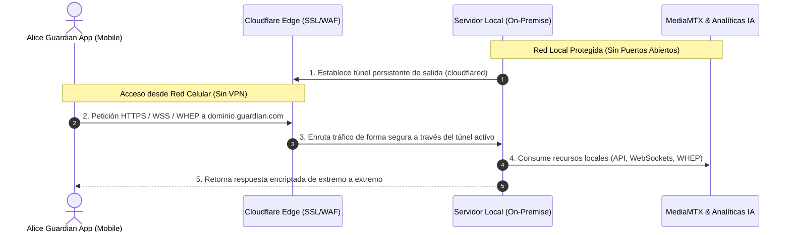
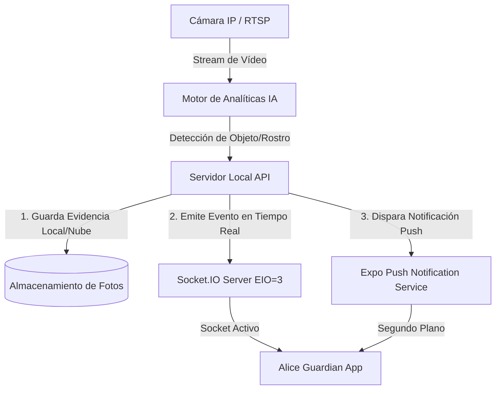

# Propuesta Técnica: Conectividad Segura de Servidores Locales y Migración de Alertas de Telegram a AliceGuardianApp

Esta propuesta describe la arquitectura necesaria para conectar la aplicación móvil **SIVI (Alice Guardian App)** a servidores locales remotos de forma segura y eficiente, **sin utilizar VPNs** y manteniendo la misma base de código. Asimismo, establece la estrategia para migrar las alertas actualmente enviadas por Telegram a notificaciones nativas e integradas directamente en la aplicación.

---

## 👥 Resumen Ejecutivo para la Dirección Técnica

El objetivo es permitir que la aplicación móvil acceda de manera transparente y bidireccional a la API de analíticas, eventos WebSockets y streams WebRTC (WHEP) alojados en un servidor físico local (*on-premise*) instalado en una sede cliente, operando desde cualquier red externa (datos móviles, Wi-Fi externa) con latencia óptima y máxima seguridad.

### 📐 Diagrama de la Arquitectura Propuesta (Cloudflare Tunnels)



---

## 🛠️ 1. Solución de Conectividad sin VPN: Cloudflare Tunnels (Recomendado)

Para evitar la complejidad operativa de las VPNs y el riesgo de seguridad de abrir puertos en el router del cliente (*Port Forwarding*), implementaremos **Cloudflare Tunnel (`cloudflared`)**. 

### ¿Cómo funciona bajo el capó?
1. Se instala un demonio ligero y gratuito (`cloudflared`) en el servidor local del cliente.
2. Este demonio establece conexiones salientes únicamente hacia los servidores perimetrales (*Edge*) de Cloudflare mediante los puertos `78443` (HTTPS) y `53` (DNS).
3. **No se requiere IP pública fija ni abrir ningún puerto de entrada en el firewall del cliente**, anulando vectores de ataque externos y evadiendo configuraciones de ISPs restrictivas como **CGNAT** (Double-NAT).
4. El servidor queda expuesto al exterior bajo un subdominio seguro (ej. `sede-lima.guardian.imperium.pe`) controlado y protegido por las políticas de Web Application Firewall (WAF) y mitigación DDoS de Cloudflare.

### ⚙️ Configuración del Servidor Local (`config.yml` de cloudflared)
```yaml
tunnel: <TUNNEL_UUID>
credentials-file: /etc/cloudflared/<TUNNEL_UUID>.json

ingress:
  # 1. API REST y WebSockets del servidor local
  - hostname: sede-lima.guardian.imperium.pe
    service: http://localhost:3000
  # 2. Servidor de Streaming WebRTC (MediaMTX)
  - hostname: stream-lima.guardian.imperium.pe
    service: http://localhost:8889
  - service: http_status:404
```

---

## 🔔 2. Canalización de Datos: De Telegram a AliceGuardianApp

Actualmente, las detecciones analíticas envían fotos por Telegram. Para integrarlo a la App de forma nativa e instantánea, implementaremos la siguiente arquitectura de eventos:



### Paso A: Almacenamiento y Acceso a Imágenes de Evidencia
Las fotos de detección generadas por la IA local se guardarán en un directorio del servidor local expuesto a través de una ruta estática en la API local (ej. `/api/v1/evidence/{image_id}.jpg`). 
Al estar protegido por el túnel de Cloudflare, la aplicación móvil cargará directamente las imágenes usando la URL pública: `https://sede-lima.guardian.imperium.pe/api/v1/evidence/{image_id}.jpg`.

### Paso B: Notificaciones Push en Tiempo Real (Expo Push Notifications)
Para reemplazar a Telegram en segundo plano (cuando la app está cerrada):
1. **Registro**: Al iniciar sesión, la app móvil solicita el token de notificaciones nativo de iOS/Android y lo registra en la base de datos del servidor local (`POST /api/v1/users/register-push-token`).
2. **Despacho**: Cuando la IA local detecta una intrusión:
   * En lugar de llamar al bot de Telegram, el servidor local envía un payload al servicio de notificaciones de Expo:
     ```json
     {
       "to": "ExponentPushToken[xxxxxxxxxxxxxxxxxxxxxx]",
       "title": "🚨 ALERTA CRÍTICA: Intrusión Detectada",
       "body": "Cámara: Pasillo Principal • Probabilidad: 98%",
       "data": { "alertId": 1042, "screen": "alerts" }
     }
     ```
   * Expo se encarga de enrutarlo hacia los servicios APNs (Apple) y FCM (Google).
3. **Acción**: Al pulsar la notificación en el celular, la aplicación se abrirá directamente en la pestaña **Alertas** enfocando el evento en cuestión con su foto de evidencia a pantalla completa.

### Paso C: Actualización en Caliente vía Sockets (Primer Plano)
Si la app está abierta en primer plano, el cliente WebSocket de la app (`useSocket.ts` conectado al Socket.IO local a través del túnel) capturará el evento al instante mediante el canal `alert`, inyectándolo en la lista de alertas en menos de **200ms**, evitando cargas innecesarias de base de datos.

---

## 💻 3. Impacto en el Código de la Aplicación Móvil

La gran ventaja de este esquema es que **no requiere rehacer la aplicación**. El ecosistema actual ya está preparado. Solo debemos inyectar dinamismo a la configuración de red:

### 🔄 Modificación 1: Configuración de Dominio Dinámica (`services/store.ts`)
En lugar de depender únicamente de dominios fijos en la constante `WORKSPACES`, modificaremos el Zustand Store para que permita resolver el dominio basándose en el **Workspace seleccionado durante el inicio de sesión**:

```typescript
// services/store.ts (Refactorización sugerida)
export const useAppStore = create<AppState>((set) => ({
  // ...
  setSession: async (domain, token, user, workspace) => {
    // Almacena dinámicamente el dominio asignado a este workspace
    await SecureStore.setItemAsync('active_domain', domain); 
    await SecureStore.setItemAsync('jwt_token', token);
    set({ activeDomain: domain, jwtToken: token, userData: user });
  },
  // ...
}));
```

### 📡 Modificación 2: URLs de Vídeo Dinámicas (`app/(tabs)/cameras.tsx`)
Alinearemos las funciones `getHlsUrl` y `getWebRtcUrl` para que apunten al dominio específico del servidor local provisto por el Store:

```typescript
function getHlsUrl(camera: Camera): string {
  // Ej: https://stream-lima.guardian.imperium.pe/camara-1/index.m3u8
  const streamDomain = domain.replace('sede-', 'stream-');
  return `https://${streamDomain}/${getStreamName(camera)}/index.m3u8`;
}

function getWebRtcUrl(camera: Camera): string {
  // Ej: https://stream-lima.guardian.imperium.pe/camara-1/whep
  const streamDomain = domain.replace('sede-', 'stream-');
  return `https://${streamDomain}/${getStreamName(camera)}/whep`;
}
```

---

## 🔒 4. Análisis de Seguridad y Viabilidad (Para el Senior Dev)

Como líder técnico senior, tu jefe evaluará rigurosamente el riesgo. Aquí tienes los argumentos técnicos que justifican la viabilidad:

1. **Zero Trust Network Access (ZTNA)**: Cloudflare Tunnel elimina por completo la superficie de exposición del servidor local. Ningún hacker en internet puede escanear puertos abiertos (ej. no hay puertos `80`, `443` o `8554` expuestos al exterior en la IP del cliente).
2. **Cifrado de Extremo a Extremo**: Todo el tráfico viaja encriptado mediante TLS v1.3 desde la app móvil hasta Cloudflare, y desde Cloudflare hasta el daemon local.
3. **Control del Ancho de Banda**: El streaming de vídeo WebRTC consume un ancho de banda insignificante de subida en la sede gracias al códec **H.264/H.265** optimizado y la latencia sub-segundo nativa, eliminando los cuellos de botella de renderizado.
4. **Desconexión Total de Terceros**: Las imágenes de evidencia ya no viajan a los servidores externos de Telegram, permaneciendo seguras bajo el control del túnel TLS propio de la empresa, cumpliendo con regulaciones de protección de datos.

---

## 📈 5. Plan de Acción Técnico para Implementación

1. **Fase 1 (Sede / Servidor)**:
   * Levantar el servicio `cloudflared` en el servidor local.
   * Mapear los dominios en Cloudflare DNS (ej. `sede-01.tudominio.com`).
2. **Fase 2 (API Backend)**:
   * Reemplazar la llamada a la API de bots de Telegram en el disparador de eventos analíticos por una llamada al servicio de notificaciones de Expo.
   * Crear la ruta estática segura para servir las capturas de detección JPG.
3. **Fase 3 (Mobile App)**:
   * Registrar el token de Expo Push Notifications al iniciar sesión.
   * Ajustar la resolución dinámica de dominios en `store.ts` y las URLs de vídeo en `cameras.tsx`.
   * Integrar la respuesta al pulsar notificaciones en el ciclo de vida de Expo Router.
